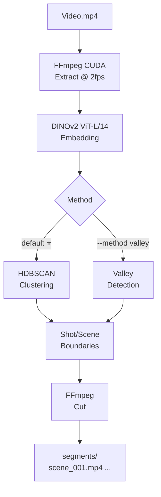

# DINOv2-ShotCut

> Generated by DeepSeek

[🇨🇳 中文版 →](README_CN.md)

---

A video shot segmentation & cutting tool powered by clustering analysis. Default: **HDBSCAN clustering** (recommended), optional valley detection.

**Pipeline:** Video → DINOv2 embeddings → HDBSCAN clustering → Shot/Scene boundaries → Video cutting


## Pipeline




## Pipeline


## Installation

```bash
pip install -r requirements.txt
```

For GPU embedding extraction (requires CUDA):
```bash
pip install torch torchvision opencv-python
```

## Usage

```bash
# Process video, show scenes (HDBSCAN clustering, default)
python -m shotseg video.mp4 --show

# Process and cut video
python -m shotseg video.mp4 --show --cut segments/

# Use valley detection
python -m shotseg video.mp4 --method valley --show

# Use pre-extracted embeddings
python -m shotseg embeddings.npz --show -o result.json
```

## Python API

```python
from shotseg import ShotSeg

seg = ShotSeg(method="hdbscan")
result = seg.segment(embeddings, timestamps)

for t in result.scene_boundaries:
    print(f"Cut point: {t:.1f}s")

from shotseg.ffmpeg import cut_segments
segments = cut_segments("video.mp4", result.scene_boundaries)
```

## Methods

| Method | Approach | Recommendation |
|--------|----------|----------------|
| **HDBSCAN** | DINOv2 → temporal encoding → UMAP → HDBSCAN → density merge | ⭐ Recommended |
| Valley | DINOv2 → centroid similarity curve → adaptive threshold | Fallback |

## Project Structure

```
shotseg/
├── __init__.py       Package entry & version
├── __main__.py       CLI entry
├── pipeline.py       ShotSeg (HDBSCAN / Valley)
├── clustering.py     HDBSCAN + temporal encoding + UMAP
├── detection.py      Valley detection
├── merge.py          Shot → scene merging
├── types.py          Data structures
├── ffmpeg.py         FFmpeg (GPU accelerated, auto CUDA)
└── embed.py          DINOv2 embedding (GPU only)
```

## Parameters

| Flag | Default | Description |
|------|---------|-------------|
| `--method` | `hdbscan` | hdbscan / valley |
| `--fps` | 2.0 | Frame extraction rate |
| `--cut` | — | Output dir for cutting |
| `--min-cluster-size` | 4 | Min HDBSCAN cluster size |
| `--time-weight` | 0.3 | Temporal feature weight |
| `--spread-factor` | 1.2 | Density merge threshold |
| `--window` | 40 | Valley sliding window |
| `--k` | 1.8 | Valley threshold multiplier |

## License

MIT
