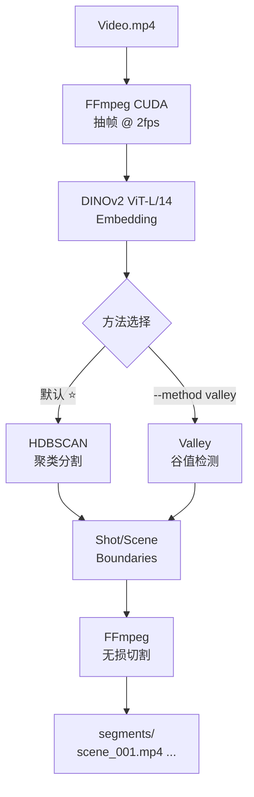

# DINOv2-ShotCut

> 由 DeepSeek 生成

[🇬🇧 English →](README.md)

---

基于聚类分析的视频镜头分割与切割工具。默认 **HDBSCAN 聚类**（推荐），可选谷值检测。

**核心流程:** 视频 → DINOv2 embedding → HDBSCAN 聚类 → 镜头边界 → 视频切割


## Pipeline




## 安装

```bash
pip install -r requirements.txt
```

GPU embedding 提取（需 CUDA）:
```bash
pip install torch torchvision opencv-python
```

## 使用

```bash
# 处理视频并查看场景（HDBSCAN 聚类，默认）
python -m shotseg video.mp4 --show

# 处理并切割视频
python -m shotseg video.mp4 --show --cut segments/

# 使用谷值检测
python -m shotseg video.mp4 --method valley --show

# 使用已有 embedding 文件
python -m shotseg embeddings.npz --show -o result.json
```

## Python API

```python
from shotseg import ShotSeg

seg = ShotSeg(method="hdbscan")
result = seg.segment(embeddings, timestamps)

for t in result.scene_boundaries:
    print(f"切点: {t:.1f}s")

from shotseg.ffmpeg import cut_segments
segments = cut_segments("video.mp4", result.scene_boundaries)
```

## 方法对比

| 方法 | 原理 | 推荐度 |
|------|------|--------|
| **HDBSCAN** | DINOv2 → 时序编码 → UMAP → HDBSCAN → 密度合并 | ⭐ 推荐 |
| Valley | DINOv2 → centroid 相似度曲线 → 自适应阈值 | 附带 |

## 项目结构

```
shotseg/
├── __init__.py       包入口 & 版本
├── __main__.py       CLI 入口
├── pipeline.py       ShotSeg 主流程 (HDBSCAN / Valley)
├── clustering.py     HDBSCAN + 时序编码 + UMAP
├── detection.py      谷值检测
├── merge.py          镜头 → 场景合并
├── types.py          数据结构
├── ffmpeg.py         FFmpeg（GPU 加速，自动 CUDA）
└── embed.py          DINOv2 embedding（GPU only）
```

## 参数

| 参数 | 默认值 | 说明 |
|------|--------|------|
| `--method` | `hdbscan` | hdbscan / valley |
| `--fps` | 2.0 | 抽帧帧率 |
| `--cut` | — | 切割输出目录 |
| `--min-cluster-size` | 4 | HDBSCAN 最小聚类大小 |
| `--time-weight` | 0.3 | 时间特征权重 |
| `--spread-factor` | 1.2 | 密度合并阈值 |
| `--window` | 40 | 谷值滑动窗口 |
| `--k` | 1.8 | 谷值阈值倍数 |

## License

MIT
